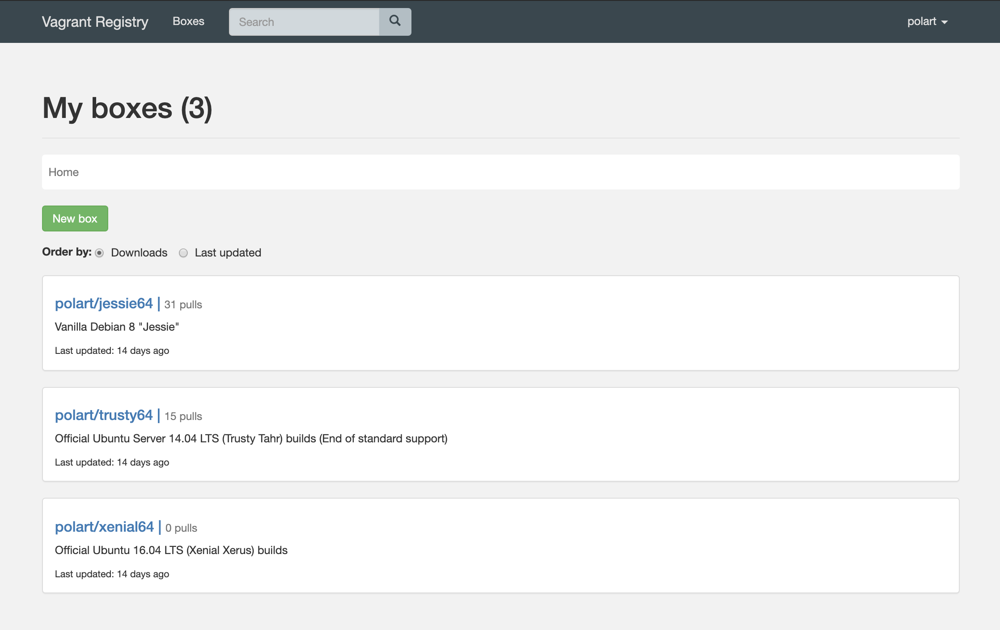
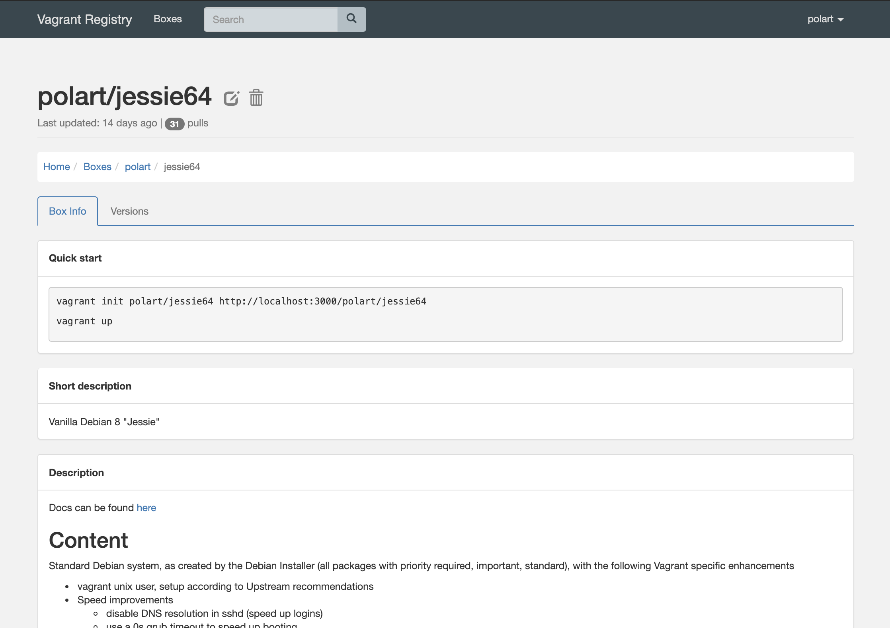
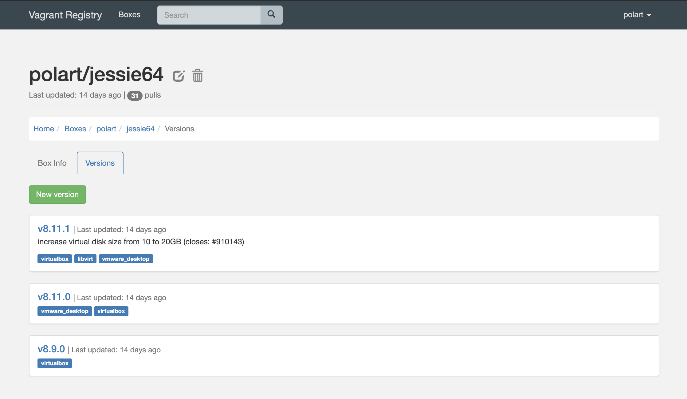

# BCloud Registry

BCloud Registry is a private self-hosted alternative to [Vagrant Cloud](https://app.vagrantup.com/).

Features:
- user management
- private/public boxes
- upload/download boxes via web app
- boxes are stored on a local drive







## Usage
### Public boxes

To use public boxes from Vagrant Registry specify box name and URL, for example
```
$ vagrant init devbens/jessie64 http://localhost:3000/devbens/jessie64
$ vagrant up
```

### Private boxes

Log in into BCloud Registry using [BCloud Registry plugin](https://github.com/devbens/bcloud-registry-plugin)
```
$ vagrant registry login http://localhost:3000
```

Init and launch a box
```
$ vagrant init devbens/jessie64 http://localhost:3000/devbens/jessie64
$ vagrant up
```

<p align="center"></p>

## Production deploy

Vagrant Registry is distributed as a single docker file and available 
on Docker registry [devbens/bcloud-registry](https://hub.docker.com/r/devbens/bcloud-registry)

Generate a secret key 
```
$ export SECRET_KEY=$(LC_ALL=C tr -dc 'A-Za-z0-9!#$%&' </dev/urandom | head -c 50 ; echo)
```

Create directories for logs and boxes files
```
$ mkdir -p \
    /var/vr/logs/nginx \
    /var/vr/logs/supervisord \
    /var/vr/logs/gunicorn \
    /var/vr/logs/django \
    /var/vr/protected_media
```

Create superuser
```
$ docker exec -it bcloud-registry python3 /code/api/manage.py createsuperuser
```

Start BCloud Registry
```
$ docker run \
    --rm -d\
    -e SECRET_KEY \
    -v /var/vr/logs/:/logs/ \
    -v /var/vr/protected_media/:/code/api/protected_media/ \
    -v vr-db:/var/lib/postgresql \
    -p 8080:80 \
    --name bcloud-registry \
    devbens/bcloud-registry:0.1.0
```

Make sure to run Vagrant Registry behind [reverse proxy](https://en.wikipedia.org/wiki/Reverse_proxy)

## Development

Vagrant Registry is written with Python/Django and ReactJS.

Make sure you have installed Docker and Docker Compose.

Apply DB migrations
```
$ make migrate
```

Create superuser
```
$ make create_superuser
```

Install Yarn packages
```
$ make install_client
```

Start React app and Django server
```
$ make start
```

Open 
- http://localhost:3000 - web app
- http://localhost:3000/admin/ - Django admin
- http://localhost:3000/api/docs/ - API docs

Run tests
```
$ make test
```
